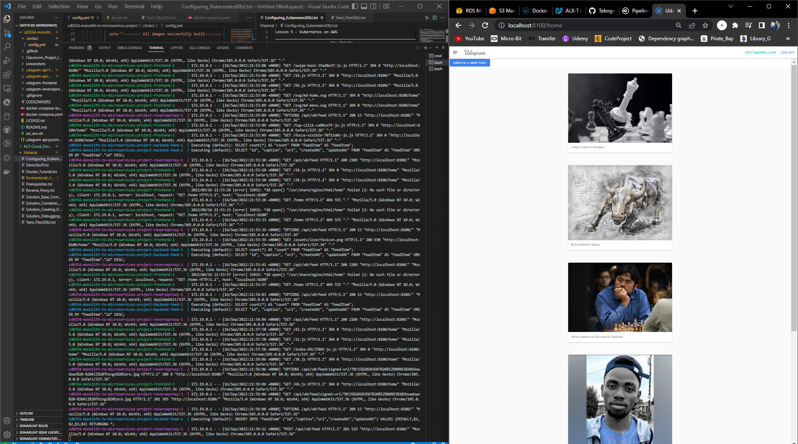

# Image Social Microservices Application

This cloud application allows users to register and log into a web client, post photos to the feed, and process photos using an image filtering microservice.



## Architecture Overview

The project has evolved from a monolithic architecture to a distributed microservices system:

### **Initial Architecture:**

- **Frontend**: Web Application built with Angular and Ionic Framework
- **Backend**: RESTful API Server using Node.js and Express.js

### **Current Microservices Architecture:**

- ### Frontend

  - Basic Ionic client web application that consumes the RestAPI Backend
  - Built with Angular and Ionic Framework
  - **Tests**: [Udagram Tests](./udagram-frontend/udagram_tests)

- ### Reverse Proxy

  - Routes and load balances requests between microservices
  - **Configuration Files**:
    - [Dockerfile](./udagram-reverseproxy/Dockerfile)
    - [nginx.conf](./udagram-reverseproxy/nginx.conf)

- ### RestAPI Backend Microservices

  Node-Express servers deployed as separate microservices in the cloud:

  - **API-Feed Service**: Handles feed-related operations
  - **API-User Service**: Manages user authentication and profiles

- ### Image Filtering Microservice

  - Standalone Node-Express application for image processing
  - Runs scripts to apply filters and process uploaded images
  - **Separate Repository**: [Udagram Image Filtering Microservice](https://github.com/TebogoYungMercykay/Udagram_Image_Filtering_Microservice.git)

## Documentation & Testing Resources

For detailed instructions on verifying this project functionality, refer to the following resources in the /docs directory:

- **README.md**: Showing the app actually working.
- **manual.pdf**: Step-by-step manual for setup and deployment.
- **postman**: Contains a Postman collection with example queries for testing API endpoints.
- **instructions**: This folder contains the specification and task at hand.

Review these files to ensure proper setup and to test all features of the Udagram Image Filtering Microservice.

## Project Structure

```
.
├── deployment
│   ├── aws-secret.yaml
│   ├── backend-feed-deployment.yaml
│   ├── backend-feed-service.yaml
│   ├── backend-user-deployment.yaml
│   ├── backend-user-service.yaml
│   ├── env-configmap.yaml
│   ├── env-secret.yaml
│   ├── frontend-deployment.yaml
│   ├── frontend-service.yaml
│   ├── reverseproxy-deployment.yaml
│   └── reverseproxy-service.yaml
├── docker-compose-build.yaml
├── docker-compose.yaml
├── docs
│   ├── guide.md
│   ├── images
│   │   ├── Microservices.png
│   │   ├── README.png
│   │   └── screenshots/
│   ├── instructions/
│   ├── postman
│   │   └── udagram-api.postman_collection.json
│   └── README.md
├── LICENSE
├── README.md
├── set_env.sh
├── tree.txt
├── udagram-api-feed
│   ├── Dockerfile
│   ├── mock/
│   ├── package.json
│   ├── package-lock.json
│   ├── src
│   │   ├── aws.ts
│   │   ├── config
│   │   │   └── config.ts
│   │   ├── controllers
│   │   │   └── v0
│   │   │       ├── feed
│   │   │       │   ├── models
│   │   │       │   │   └── FeedItem.ts
│   │   │       │   └── routes
│   │   │       │       └── feed.router.ts
│   │   │       ├── index.router.ts
│   │   │       └── model.index.ts
│   │   ├── migrations
│   │   │   └── 20190325-create-feed-item.js
│   │   ├── sequelize.ts
│   │   └── server.ts
│   ├── tsconfig.json
│   └── tslint.json
├── udagram-api-user
│   ├── Dockerfile
│   ├── package.json
│   ├── package-lock.json
│   ├── src
│   │   ├── aws.ts
│   │   ├── config
│   │   │   └── config.ts
│   │   ├── controllers
│   │   │   └── v0
│   │   │       ├── index.router.ts
│   │   │       ├── model.index.ts
│   │   │       └── users
│   │   │           ├── models
│   │   │           │   └── User.ts
│   │   │           └── routes
│   │   │               ├── auth.router.ts
│   │   │               └── user.router.ts
│   │   ├── migrations
│   │   │   └── 20190328-create-user.js
│   │   ├── sequelize.ts
│   │   └── server.ts
│   ├── tsconfig.json
│   └── tslint.json
├── udagram-frontend
│   ├── angular.json
│   ├── Dockerfile
│   ├── e2e
│   │   ├── protractor.conf.js
│   │   ├── src
│   │   │   ├── app.e2e-spec.ts
│   │   │   └── app.po.ts
│   │   └── tsconfig.e2e.json
│   ├── ionic.config.json
│   ├── package.json
│   ├── package-lock.json
│   ├── src
│   │   ├── app
│   │   │   ├── api
│   │   │   │   ├── api.module.ts
│   │   │   │   └── api.service.ts
│   │   │   ├── app.component.html
│   │   │   ├── app.component.spec.ts
│   │   │   ├── app.component.ts
│   │   │   ├── app.module.ts
│   │   │   ├── app-routing.module.ts
│   │   │   ├── auth
│   │   │   │   ├── auth-login
│   │   │   │   │   ├── auth-login.component.html
│   │   │   │   │   ├── auth-login.component.scss
│   │   │   │   │   ├── auth-login.component.spec.ts
│   │   │   │   │   └── auth-login.component.ts
│   │   │   │   ├── auth-menu-button
│   │   │   │   │   ├── auth-menu-button.component.html
│   │   │   │   │   ├── auth-menu-button.component.scss
│   │   │   │   │   ├── auth-menu-button.component.spec.ts
│   │   │   │   │   ├── auth-menu-button.component.ts
│   │   │   │   │   └── auth-menu-user
│   │   │   │   │       ├── auth-menu-user.component.html
│   │   │   │   │       ├── auth-menu-user.component.scss
│   │   │   │   │       ├── auth-menu-user.component.spec.ts
│   │   │   │   │       └── auth-menu-user.component.ts
│   │   │   │   ├── auth.module.ts
│   │   │   │   ├── auth-register
│   │   │   │   │   ├── auth-register.component.html
│   │   │   │   │   ├── auth-register.component.scss
│   │   │   │   │   ├── auth-register.component.spec.ts
│   │   │   │   │   └── auth-register.component.ts
│   │   │   │   ├── models
│   │   │   │   │   └── user.model.ts
│   │   │   │   └── services
│   │   │   │       ├── auth.guard.service.spec.ts
│   │   │   │       ├── auth.guard.service.ts
│   │   │   │       ├── auth.service.spec.ts
│   │   │   │       └── auth.service.ts
│   │   │   ├── feed
│   │   │   │   ├── feed-item
│   │   │   │   │   ├── feed-item.component.html
│   │   │   │   │   ├── feed-item.component.scss
│   │   │   │   │   ├── feed-item.component.spec.ts
│   │   │   │   │   └── feed-item.component.ts
│   │   │   │   ├── feed-list
│   │   │   │   │   ├── feed-list.component.html
│   │   │   │   │   ├── feed-list.component.scss
│   │   │   │   │   ├── feed-list.component.spec.ts
│   │   │   │   │   └── feed-list.component.ts
│   │   │   │   ├── feed.module.ts
│   │   │   │   ├── feed-upload
│   │   │   │   │   ├── feed-upload-button
│   │   │   │   │   │   ├── feed-upload-button.component.html
│   │   │   │   │   │   ├── feed-upload-button.component.scss
│   │   │   │   │   │   ├── feed-upload-button.component.spec.ts
│   │   │   │   │   │   └── feed-upload-button.component.ts
│   │   │   │   │   ├── feed-upload.component.html
│   │   │   │   │   ├── feed-upload.component.scss
│   │   │   │   │   ├── feed-upload.component.spec.ts
│   │   │   │   │   └── feed-upload.component.ts
│   │   │   │   ├── models
│   │   │   │   │   └── feed-item.model.ts
│   │   │   │   └── services
│   │   │   │       ├── feed.provider.service.spec.ts
│   │   │   │       └── feed.provider.service.ts
│   │   │   ├── home
│   │   │   │   ├── home.module.ts
│   │   │   │   ├── home.page.html
│   │   │   │   ├── home.page.scss
│   │   │   │   ├── home.page.spec.ts
│   │   │   │   └── home.page.ts
│   │   │   └── menubar
│   │   │       ├── menubar.component.html
│   │   │       ├── menubar.component.scss
│   │   │       ├── menubar.component.spec.ts
│   │   │       └── menubar.component.ts
│   │   ├── assets
│   │   │   ├── icon
│   │   │   │   └── favicon.png
│   │   │   └── shapes.svg
│   │   ├── environments
│   │   │   ├── environment.prod.ts
│   │   │   └── environment.ts
│   │   ├── global.scss
│   │   ├── index.html
│   │   ├── karma.conf.js
│   │   ├── main.ts
│   │   ├── polyfills.ts
│   │   ├── test.ts
│   │   ├── theme
│   │   │   └── variables.scss
│   │   ├── tsconfig.app.json
│   │   └── tsconfig.spec.json
│   ├── tsconfig.json
│   ├── tslint.json
│   └── udagram_tests
│       └── git_test.sh
└── udagram-reverseproxy
    ├── Dockerfile
    └── nginx.conf
```

## Credits

- **Starter Code**: [Udacity Cloud Developer Course](https://github.com/udacity/cloud-developer/tree/master)
- This project was developed as part of the Udacity Cloud Engineering Nanodegree program.

## License

This project is licensed under the terms described in the [LICENSE](./LICENSE) file.

---
