# Deployment Documentation

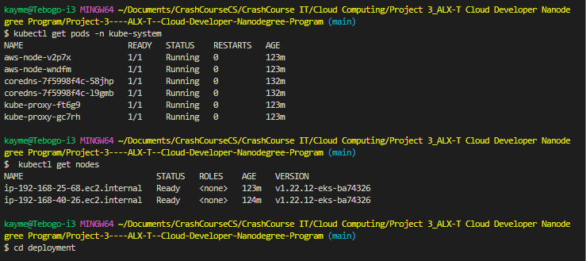

> This project uses CircleCI for Continuous Integration and Deployment. Below are the screenshots demonstrating the infrastructure setup and deployment pipeline.

## Kubernetes Deployment

#### Application Running

Screenshot showing the application running successfully in the browser:

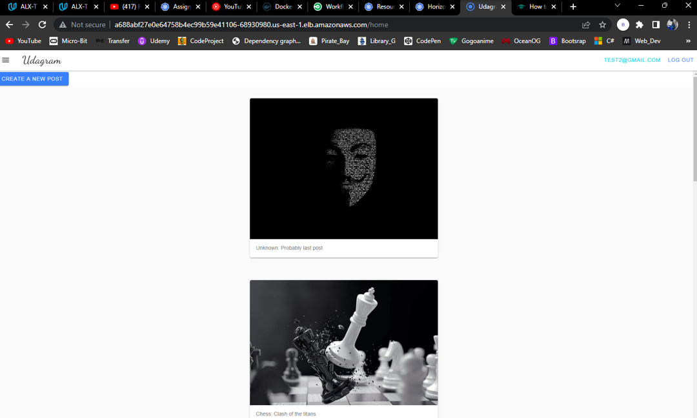

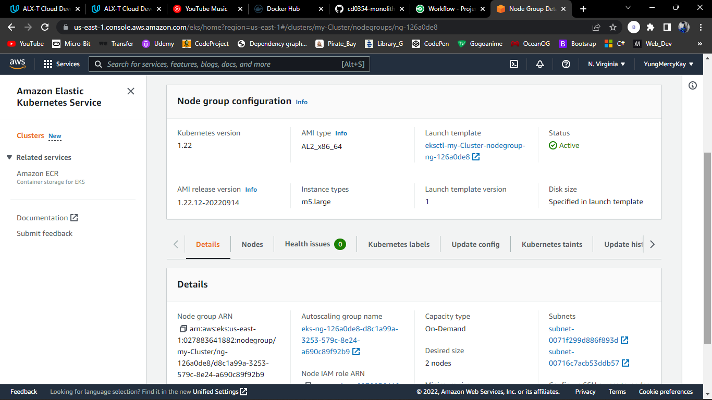

#### Pods Verification

To verify Kubernetes pods are deployed properly:

```bash
kubectl get pods
```


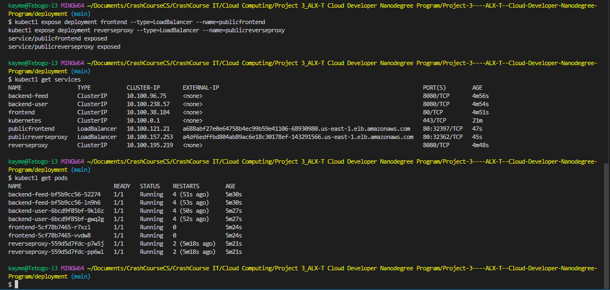

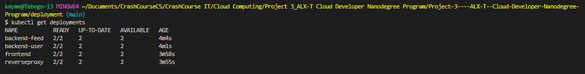

#### Horizontal Pod Autoscaler (HPA)

To verify horizontal scaling is configured against CPU usage:

```bash
kubectl get hpa
```

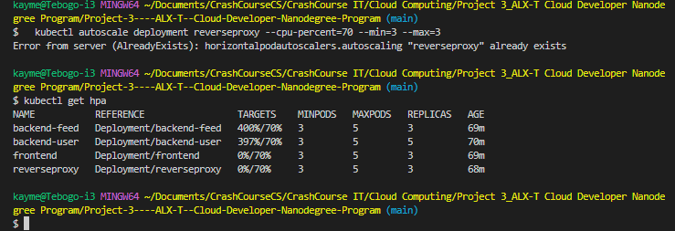

#### Services Configuration

To verify Kubernetes services are properly configured:

```bash
kubectl describe services
```

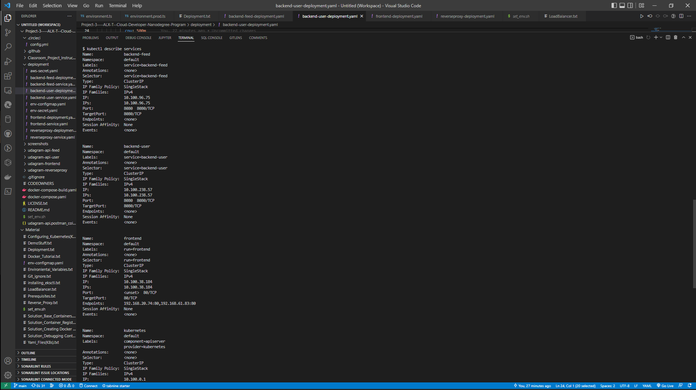

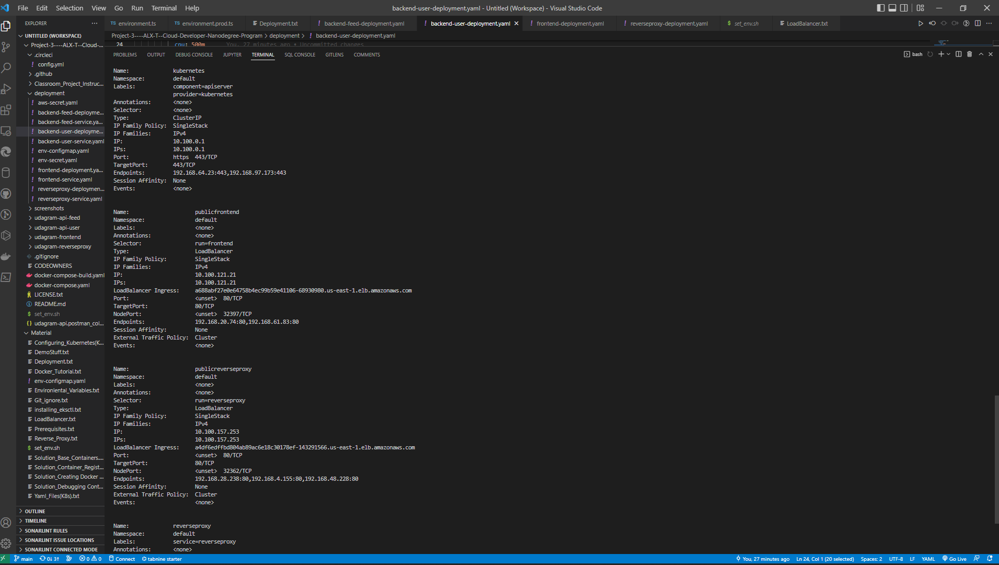

#### Application Logging

To verify logging is set up with backend applications:

```bash
kubectl logs {pod_name}
```

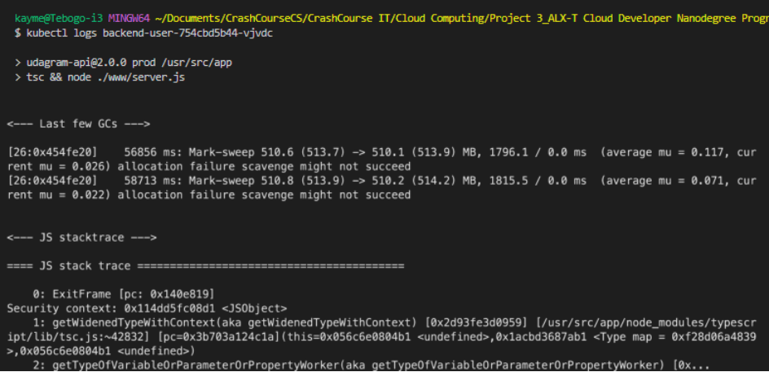

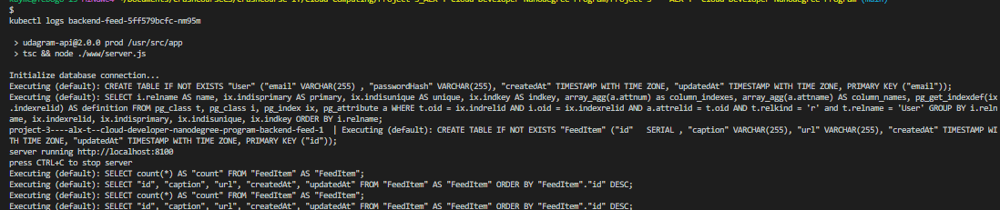

## Continuous Integration & Deployment Pipeline

#### Docker Locally

Verifying that Docker images running containers on the local machine before pushing them to DockerHub.

```bash
docker images
docker ps
```

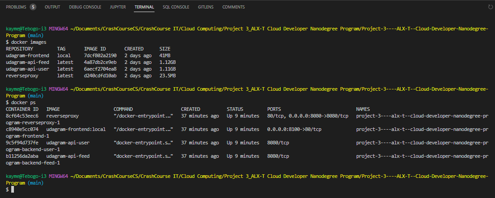

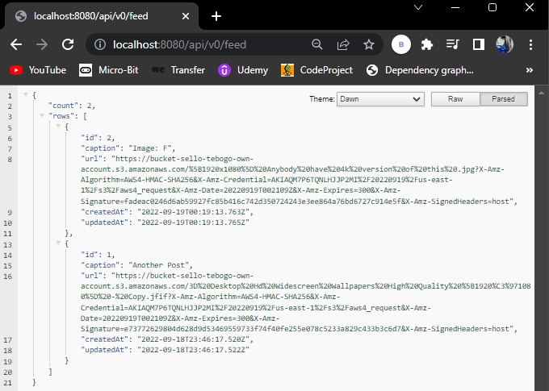

#### DockerHub Container Registry

DockerHub repository showing the containers that have been pushed:

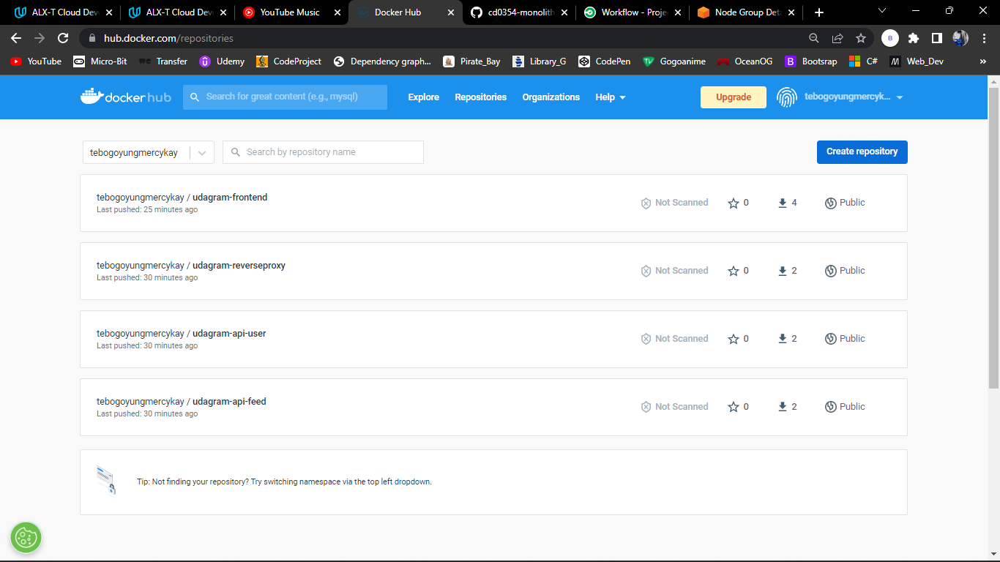

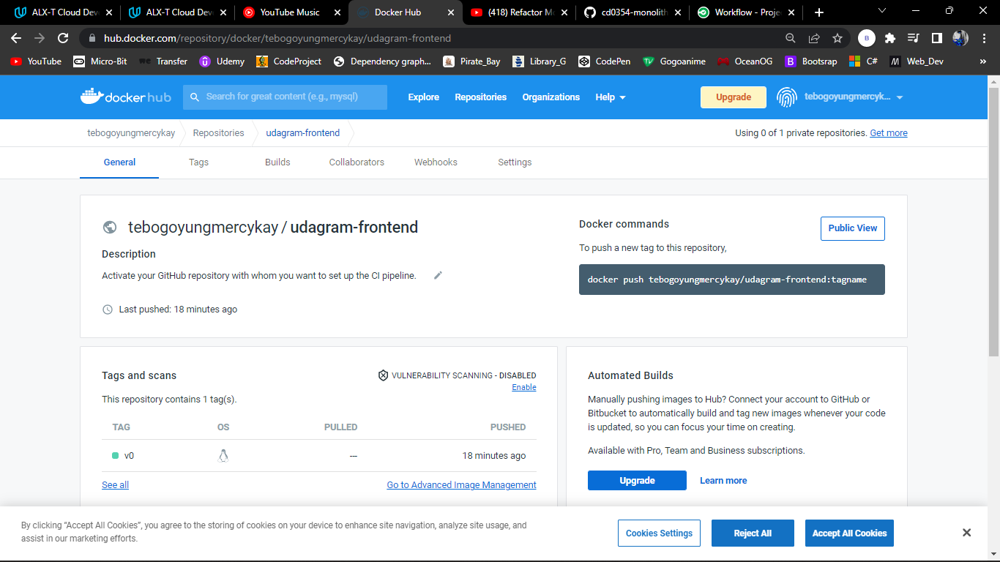

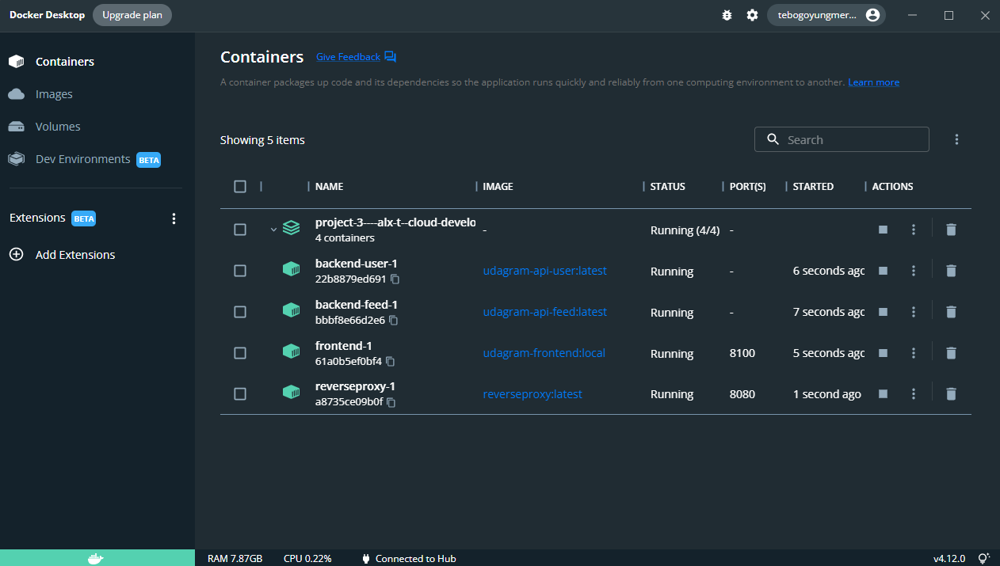

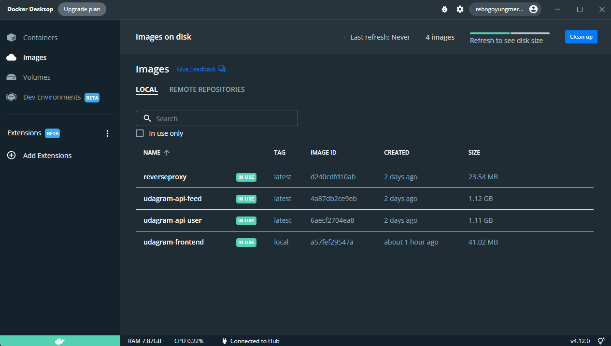

#### CircleCI Webhook Integration

GitHub repository settings showing the CircleCI webhook configuration (Settings → Webhooks):

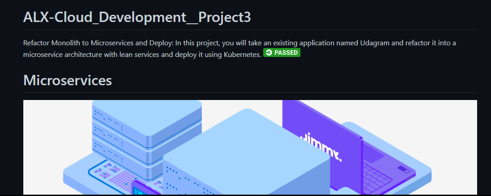

#### CircleCI Build Success

CircleCI dashboard showing successful build and deployment jobs:

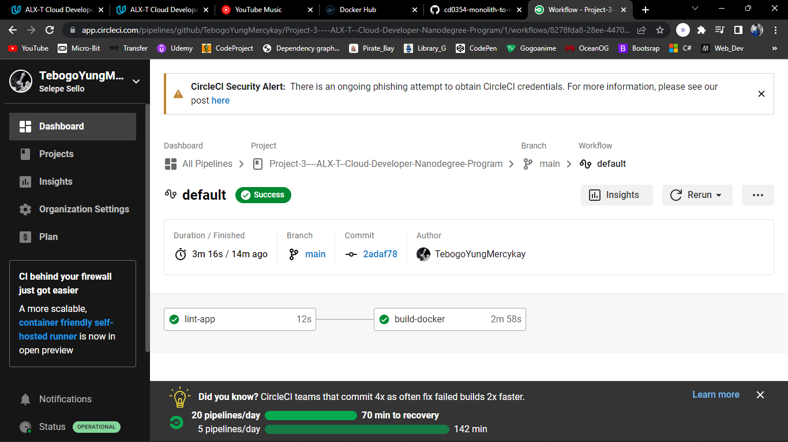

---

## Infrastructure Review

To help review the infrastructure setup, the above screenshots demonstrate:

1. **Kubernetes Cluster Health**: All pods are running successfully
2. **Service Discovery**: Kubernetes services are properly configured
3. **Auto-scaling**: HPA is configured for CPU-based scaling
4. **Monitoring & Logging**: Application logs are accessible via kubectl
5. **Container Registry**: Docker images are successfully pushed to DockerHub
6. **CI/CD Pipeline**: CircleCI is integrated with GitHub and executing successful deployments

This confirms that the microservices architecture is properly deployed and the continuous integration pipeline is functioning as expected.

---
